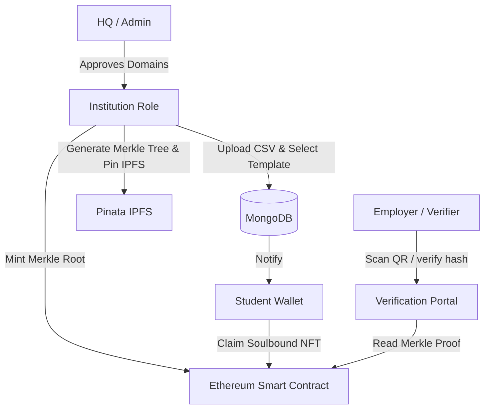
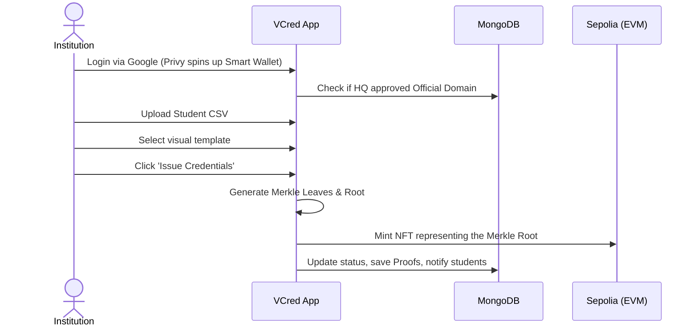
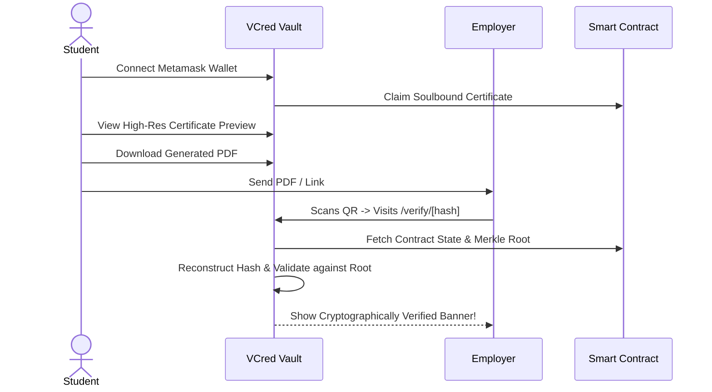

# VCred (ACCRED) - High-Fidelity Academic Credentialing on Web3


VCred is an enterprise-grade platform designed to revolutionize academic credentialing. It leverages Ethereum (Sepolia), Merkle Trees, and IPFS to issue cryptographically secure, privacy-preserving, and tamper-proof Soulbound NFTs (Non-Transferable ERC-721 tokens) for academic degrees and certificates. 

With VCred, institutions can eliminate credential fraud while providing students with a verifiable, digital proof of their academic achievements that lasts forever.

---

## 🚀 Key Features

- **Wallet-Less Institution Onboarding**: Institutions don't need complex crypto-wallets. VCred uses Privy Google Auth and Alchemy Account Abstraction to spin up gasless Smart Accounts under the hood.
- **Privacy-Preserving Anchoring**: Student PII (Personally Identifiable Information) never touches the public blockchain. VCred only stores an aggregated **Merkle Root** on-chain, while the individual encrypted leaf hashes are pinned to IPFS. This drastically reduces gas costs and protects student privacy.
- **Beautiful Certificate Designer**: Institutions can select from beautiful built-in templates (Professional, Elegant Script, Vibrant Dynamic, Academic Scroll, Minimalist) to issue high-fidelity academic credentials natively rendering as PDFs.
- **Cryptographic Verification Portal**: Employers or third parties can scan the credential's QR code to visit the `/verify/[hash]` portal. The portal mathematically confirms whether the data (CGPA, Name, Batch) has been tampered with by checking the on-chain Merkle Root.

---

## 🛠️ Technology Stack

- **Frontend**: Next.js 15 (App Router), React 19, Tailwind CSS, Framer Motion
- **Backend & Database**: Next.js API Routes, MongoDB (Mongoose), Nodemailer
- **Web3 Ecosystem**: Ethers.js, Viem, Wagmi, Privy (Auth + Embedded Wallets), Pinata (IPFS)
- **Smart Contracts**: Hardhat, Solidity, OpenZeppelin (AccessControl, ERC721)

---

## 🏗️ Architecture & Workflows

### System Sub-Actors



### 1. Institution Onboarding & Minting Flow



### 2. Student & Verification Flow



---

## 📦 Local Setup & Installation

### Prerequisites
- Node.js (v18 or higher)
- MongoDB Cluster URL
- Hardhat / Alchemy RPC setup for Ethereum Sepolia
- Pinata JWT (for IPFS pinning)
- Groq API Key (for Vision interactions)

### Installation

1. **Clone the Repository**
   ```bash
   git clone https://github.com/upo2201/Accred_proj.git
   cd Accred_proj
   ```

2. **Install Dependencies**
   ```bash
   npm install
   ```

3. **Configure Environment Variables**
   Create a `.env.local` file at the root of the project with the following required variables:
   ```env
   # Database
   MONGODB_URI=your_mongo_url
   
   # Web3
   NEXT_PUBLIC_CONTRACT_ADDRESS=0x_your_deployed_contract
   PRIVATE_KEY=your_deployer_wallet_key
   PINATA_JWT=your_pinata_jwt
   NEXT_PUBLIC_GATEWAY_URL=gateway.pinata.cloud
   
   # Privy
   NEXT_PUBLIC_PRIVY_APP_ID=your_privy_id
   
   # System URL
   NEXT_PUBLIC_APP_URL=http://localhost:3000
   ```

4. **Run the Development Server**
   ```bash
   npm run dev
   ```
   Navigate to `http://localhost:3000` to start issuing and verifying credentials!

### Smart Contract Deployment
To update or test the core registry contract locally via Hardhat:
```bash
npx hardhat compile
npx hardhat test
npx hardhat run scripts/deploy.js --network sepolia
```

## 🔒 Security Summary
VCred strictly issues **Soulbound Tokens (SBTs)**. Once an institution signs and distributes a credential to a student's wallet address, the NFT cannot be sold, transferred, or moved. It behaves as a permanent decentralized record. Institutions retain the authority to revoke a credential if it was issued in error or due to disciplinary action. In such cases, the `/verify` portal visually flags the document as revoked, maintaining the absolute integrity of the ecosystem.
